 # Bark & Stride 
 Bark & stride is a site that hopes to build up a small business for a local dog walker in the North County Dublin region. 
 The site will be targeted towards local dog owners who are looking for a way to keep their dog active, social or trained. 
 Offering a wide range of services for the dog owner who is short on time but want to give their pet the very best. 
  
 ****** 
 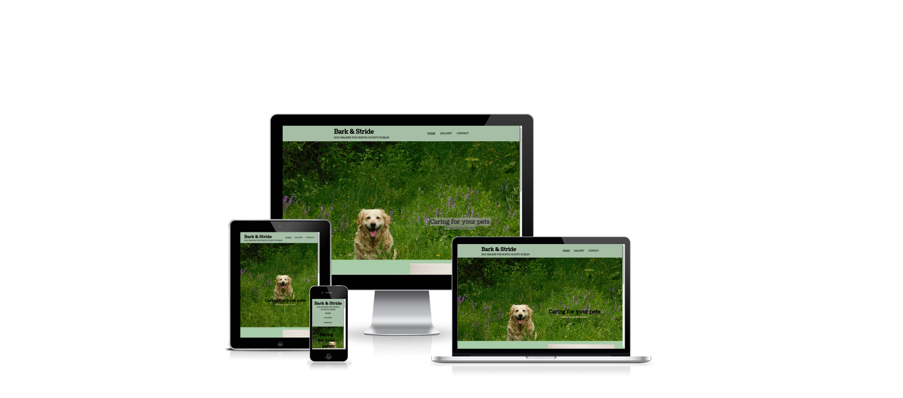
 [View the live site here] (https://davetrev.github.io/bark-and-stride/)

 ### Project Goals
 - Help local pet owners access a dog walking service
 - Learn more about the ethos of the service
 - Contact the local dog walker to engage in their services

 ### Website Owner Goals
 - Reach the target audience
 - Increase engagment and build a small business
 - Have a method of direct interaction with the customer  

 ## User experience
 ### Target audience
 This website is created with the follwoing target audience in mind:
 - A Dog owner in north county Dublin
 - People looking for a dog walking service
 - Customers looking for services such as dog sitting or doggy day care

 ### User requirments or expectations
 - A simple website to navigate around
 - Easy to find information
 - Social media links directing to further content and information
 - Clear presentation of content

 ## Design
 - The website was designed with a simple layout and navigation to direct customers to contacting the service
 - Using images to aid creating a better connection with their pet and the services offered
 - The colour and font choices aimed to create a friendly, relaxed feel.  

 ### Colours used
 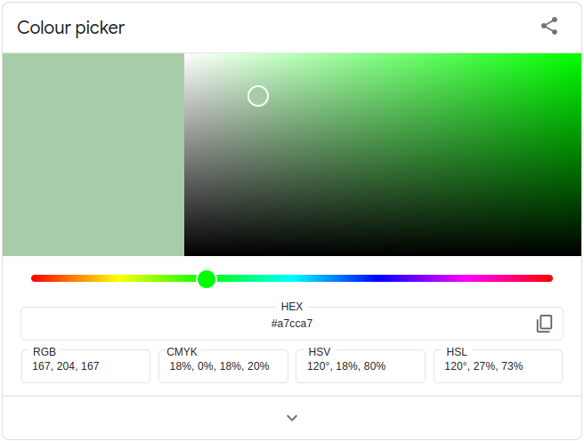

 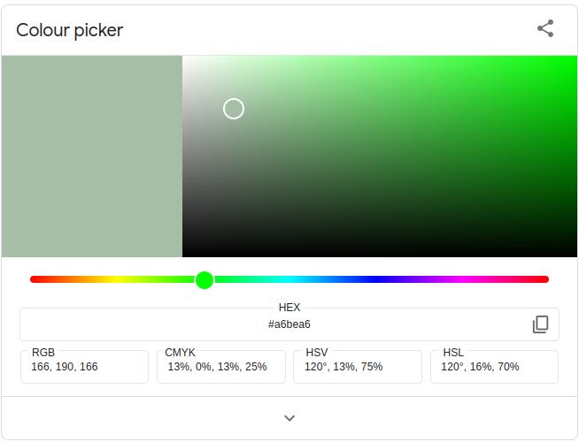
 

 ## Technologies Used
 The following languages were used to develop the website:
 - HTML
 - CSS

 ### Frameworks and Tools
 The following frameworks and tools were used to develop the website:
 - Git
 - Github
 - Gitpod
 - Google Fonts
 - Font Awesome

 ## Features   

 ### Existing Features 
  
 - __Navigation Bar__ 
  
   - Featuring on all three pages, a fullly responsive navigation bar. It includes a logo, links to the Home page, Gallery and Contact page. It is identical in each page to allow for easy navigation for the user.
   - This section allows each user to easiliy navigate from each page across all devices without having to revert back to the previous page via the 'back' button.
   - The header, nav bar and the rest of the site, use the google fonts "Coustard and Heebo". Coustard was used as the main logo typeface to create a friendly, nearly whimsical feeling for users.
   - Using a underline feature on the nav bar, its used to help the user quickly identify which page they are currently using
  
  
  
 - __The landing page image__ 
  
   - The landing includes a photograph with text overlay to allow the user to see a aspirational scene of a happy dog relaxing in a park/ forest scene.
   - This section introduces the user to Bark & Stride with a large high impact image, grabbing the attention of dog owners.
   - the image is selected to create a connection with the users/customers and the service being offered
   - The image is in a fixed position, various styles of a scrolling image was used but for responsive design, the fixed postion lead to better styling
  
 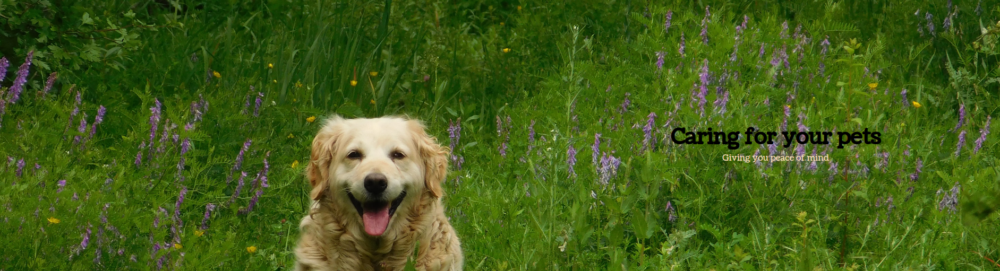 
  
 - __About Section__ 
  
   - The about section will allow the user to see the benefits of availing of the services of Bark & Stride, what services are offered and the areas covered
   - This user will see the value of contacting and availing of the service, to engage the dog owner with not just dog walking services but also the love of animals from the service but also trustworthiness.
   - Using a combination of different settings and breeds of dogs are used to keep the design interesting but again to create a sense of connection with the user.
   - Divided up into three paragraphs with a corresponding image for each paragraph
   - Each paragraph details the services offered by the service.
  
 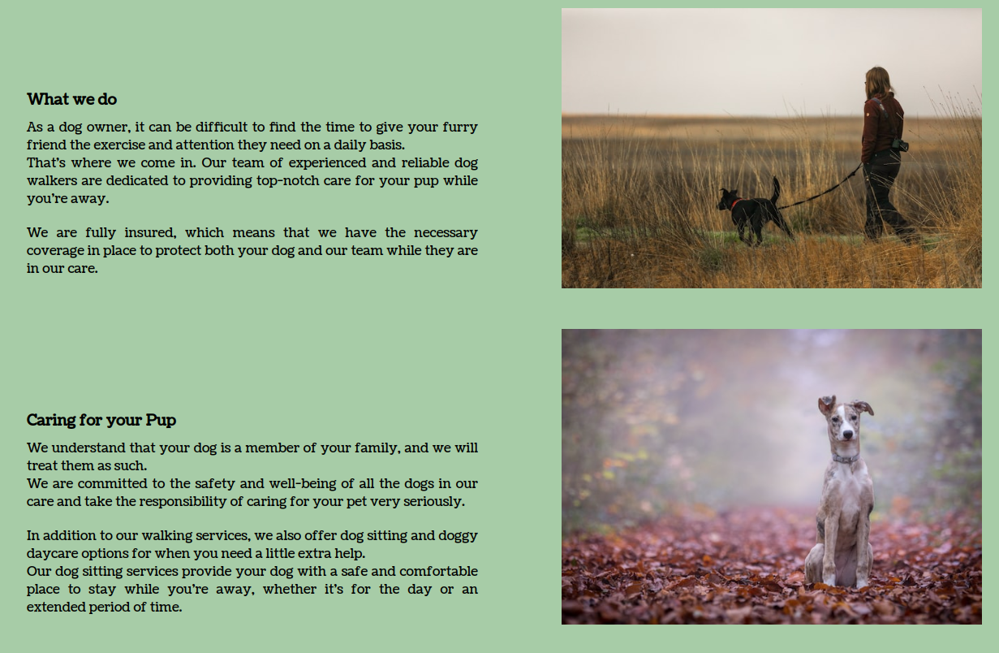 
  
   
 - __The Footer__  
  
   - Featuring on all three pages, a fullly responsive footer navigation bar. It includes links to social media. It is identical in each page to allow for easy navigation for the user.  
   - The footer section includes links to the relevant social media sites for Bark & Stride. The links will open to a new tab to allow easy navigation for the user.  
   - The footer is valuable to the user as it encourages them to keep connected via social media
  
 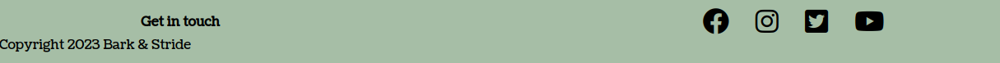 
  
 - __Gallery__ 
  
   - The gallery section will provide the user with supporting images to see aspirational images of happy dogs on walks, as the business grows, I would plan to add testimonials of happy customers but also bios of staff and pups that use the service
   - At present, at the top of the gallery page, I have placed some simple tweet reviews from customers, again looking to build a connection for the buisness and their target market.
   - This section is valuable to the user as they can identify with what they want for their pet and can identify with the service offered
  
 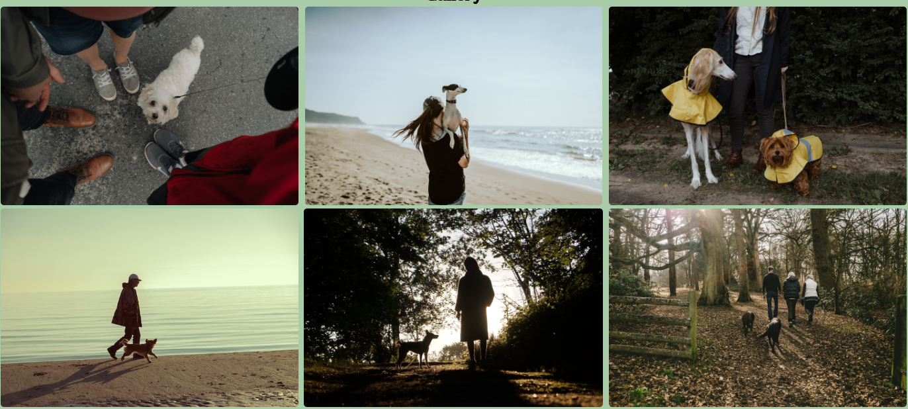 
  
 - __The Contact Page__ 
  
   - This page will allow the user to contact the business owner to arrange walks for their dog and to send queries regarding the service.
   - When the contact form is filled in and submitted it links to a simple success page. No Data is sent as this is a project at present.

 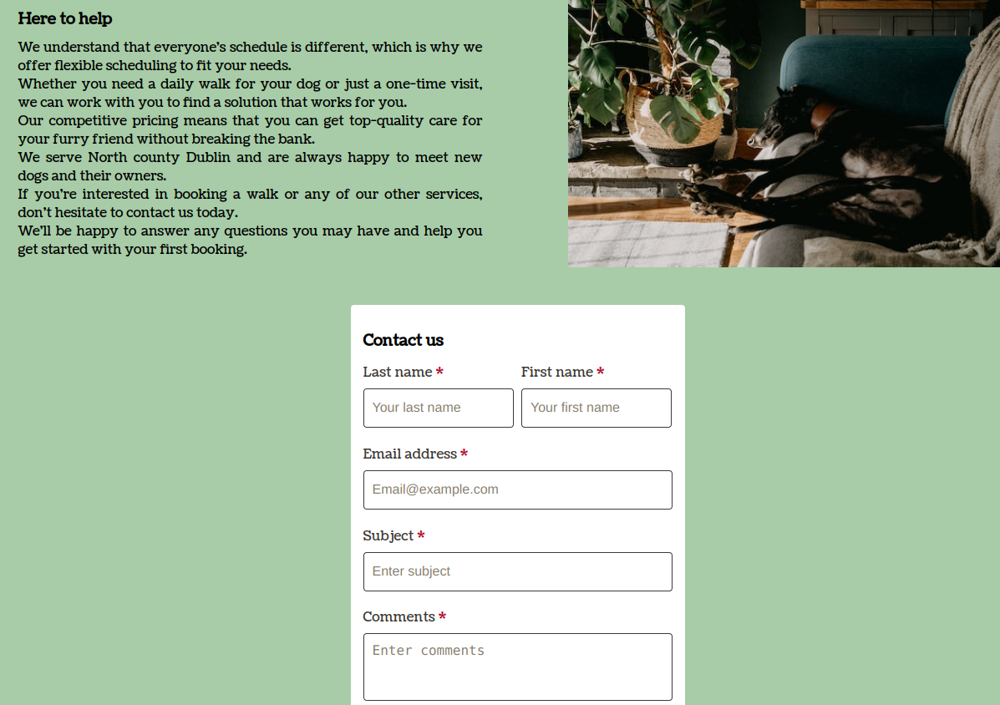 

 - __The Success Page__ 

 - When a user fills in their details, they are directed to a simple success page. It is used to confirm to the user that their details have been successfully sent.
 - The user still has access to both the nav bar and footer to navigate around the site and external links.
  
 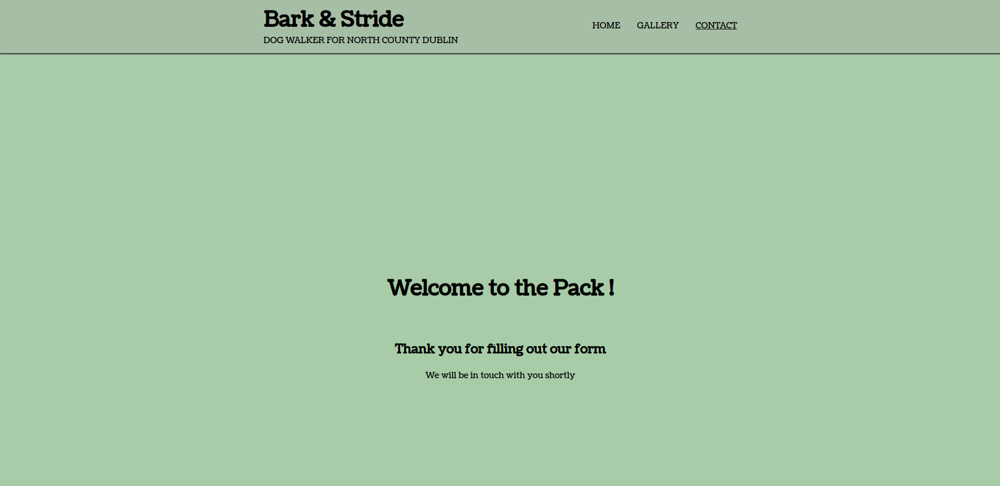

- __The 404 Page__ 

 - If a user tries to navigate to a page that does not exist, they will find a 404 page which will help them navigate back to a relevant page
 - Both the Nav bar and footer are present, along side a highlighted link to help them return to the index page
  
 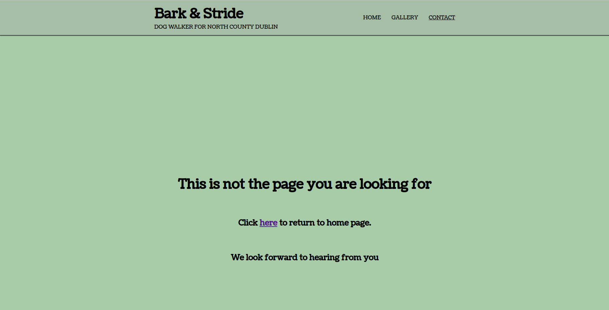

 ### Existing features

 - Responsive design that looks good on screen widths from 320px and up.
 - All external links opens in new tabs and has proper aria labels.
 - Sign up that links to a success page for the user.
  
 ### Features Left to Implement 
  
 - On the gallery page I would like to add a section of "Favourite dogs" or "Dog of the month", highlighting happy dogs and little bios on each pet.
 - Adding a map of nearby parks that are used.
 - Adding video content of dogs engaged with the walker and the surrounding area via youtube links
 - As the site is a simple three page static site, I have not created a 404 page, in the future as the features expand with potential for dead links, a 404 page will be created.
  
 ## Testing 

 - All pages have been thoroughly tested for screen sizes from 320px and up.
 - Chrome developer tools to check pages resonsiveness, Firefox, desktop pc, Ipad and android phone used to test the site.
 - The site is responsive on all screen sizes, no images are pixelated or stretched. No elements overlap.
 - I have tested that every link on the site works as intended, opens in the correct tab and if using a external link, opens to a new browser tab.

 ### Validator Testing  
  
 - HTML 
   - No errors were returned when passing through the official [W3C validator](https://validator.w3.org/nu/?useragent=Validator.nu%2FLV+http%3A%2F%2Fvalidator.w3.org%2Fservices&acceptlanguage=&doc=https%3A%2F%2Fdavetrev.github.io%2Fbark-and-stride%2F) 
 - CSS 
   - No errors were found when passing through the official [(Jigsaw) validator](https://jigsaw.w3.org/css-validator/validator?uri=https%3A%2F%2Fdavetrev.github.io%2Fbark-and-stride%2Fcontact.html&profile=css3svg&usermedium=all&warning=1&vextwarning=&lang=en)

 - Lighthouse - the following are the results from testing the site with lighthouse (mobile and desktop)

 ## Index page 
 
 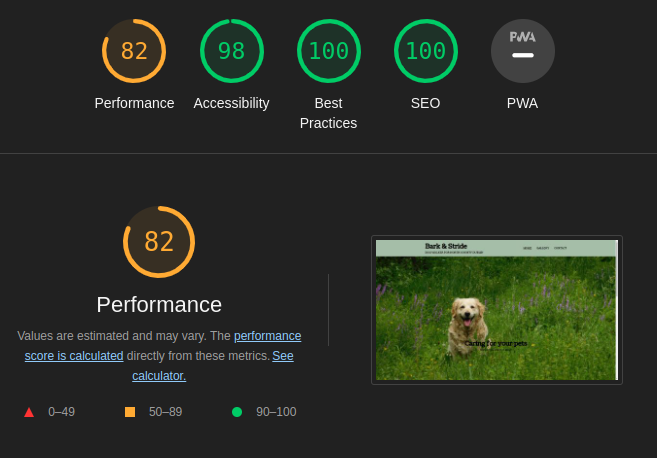 
 
 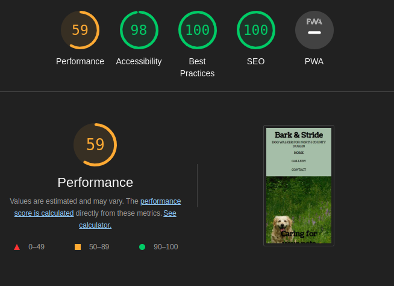 

 ## Gallery

 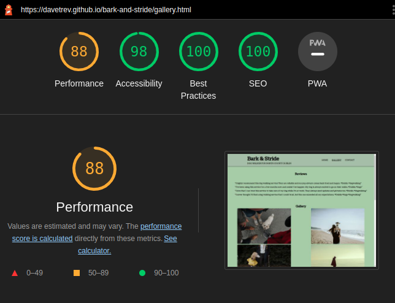

 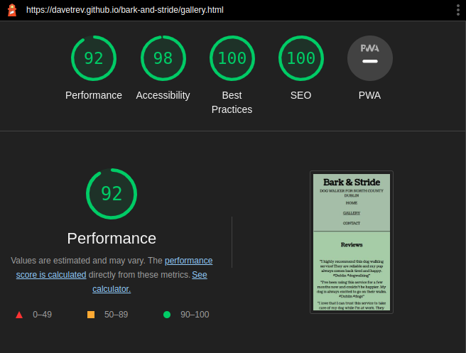

 ## Contact page
 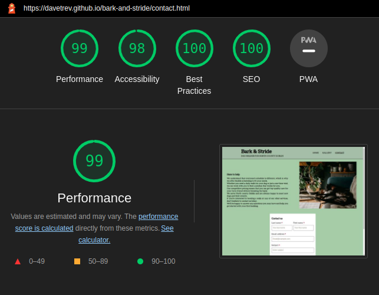

 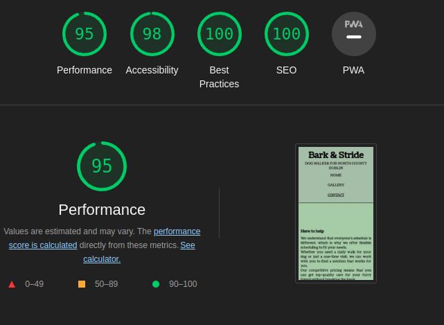
 
  
 ### Unfixed Bugs 
  
 While trying to build a website that is responsive across all devices, using the dimensions of a galaxy fold, the break point of 280 px in width would cause a gap on the right side of the screen. the image sizing and media queries need to address this.

 In future versions I would aim to massivily increase lighthouse scoring.

 The index page, I would like to have figured out a way to have the dog be the central focus of the photo across all devices, using flexbox, the image is shifting in place depending on the device used.   
 I had originally built the site desktop first and in learning more about responsive design, I realise from the project outset, I should build mobile first and work out as it is easier to deal with issues in that manner. 

  
 ## Deployment 
  
 - The website was deployed to Github pages. The steps to deploy are as follows:
    - Login to Github and find the Github repository 'bark-and-stride'
    - Click on the 'Settings' button at the top of the repository
    - Click on 'Pages' on the left hand side navigation menu
    - Select 'Deploy from a branch' under 'Source' if this is not already selected
    - Under the 'Branch' drop down menus, select 'main' and 'root'
    - Click 'Save'
    - Once the page refreshes, the live link should appear underneath the 'Github Pages' title
  
 The live link can be found here - https://davetrev.github.io/bark-and-stride/index.html 
  
  
 ## Credits  
  
 ### Content  
  
 - All content was written by myself but was inspired by Dublin based dog walker websites, which I used for inspiration are as follows:
 - https://all-dogz-go-walkies.business.site/?utm_source=gmb&utm_medium=referral
 - https://www.dogwalking.ie/
 - https://www.borrowmydoggy.com/dogs-near-me/dublin
 - http://www.pawfit.ie/

 - As a guide to learning flexbox and building layouts with css, I used the youtube video series from [Netninja] (https://www.youtube.com/watch?v=xPuYbmmPdEM)
 - Building a responsive contact form was taken from / used as a follow along guide [Plant pot works blog](https://plantpot.works/2827) 
 - Used a example of a flexbox design incorporating text and images helped build the index page and contact page format [Codepen](https://codepen.io/paulobrien/pen/baobra)
 - For a flexbox designed image gallery I used the following as a example [Logrocket blog](https://blog.logrocket.com/responsive-image-gallery-css-flexbox/)
 - As a guide to building up a responsive hero image the following links were used to learn how to use flex box [Codepen](https://codepen.io/njericooper/pen/NVRQLe) 
 - (https://nicolaslule.com/responsive-full-width-hero-image-using-flex/) 
 - (https://developer.mozilla.org/en-US/docs/Web/CSS/CSS_Flexible_Box_Layout/Aligning_Items_in_a_Flex_Container)
 - Using the following guide to help create a responsive navigation bar and using the lessons learned to create a responsive footer to match (https://adiati.com/how-to-create-a-responsive-navigation-bar-with-flexbox-and-media-queries)
 - The icons in the footer were taken from [Font Awesome](https://fontawesome.com/) 
 - Created responsive mockups with [amiresponsive] (https://ui.dev/amiresponsive)
  
 ### Media 
  
 - All images were taken from [Pexels](https://www.pexels.com/), [Unsplash](https://unsplash.com/)
 - Fonts - Coustard and Heebo, taken from Google fonts
 - Footer icons taken from [Font-Awesome](https://fontawesome.com/icons)

